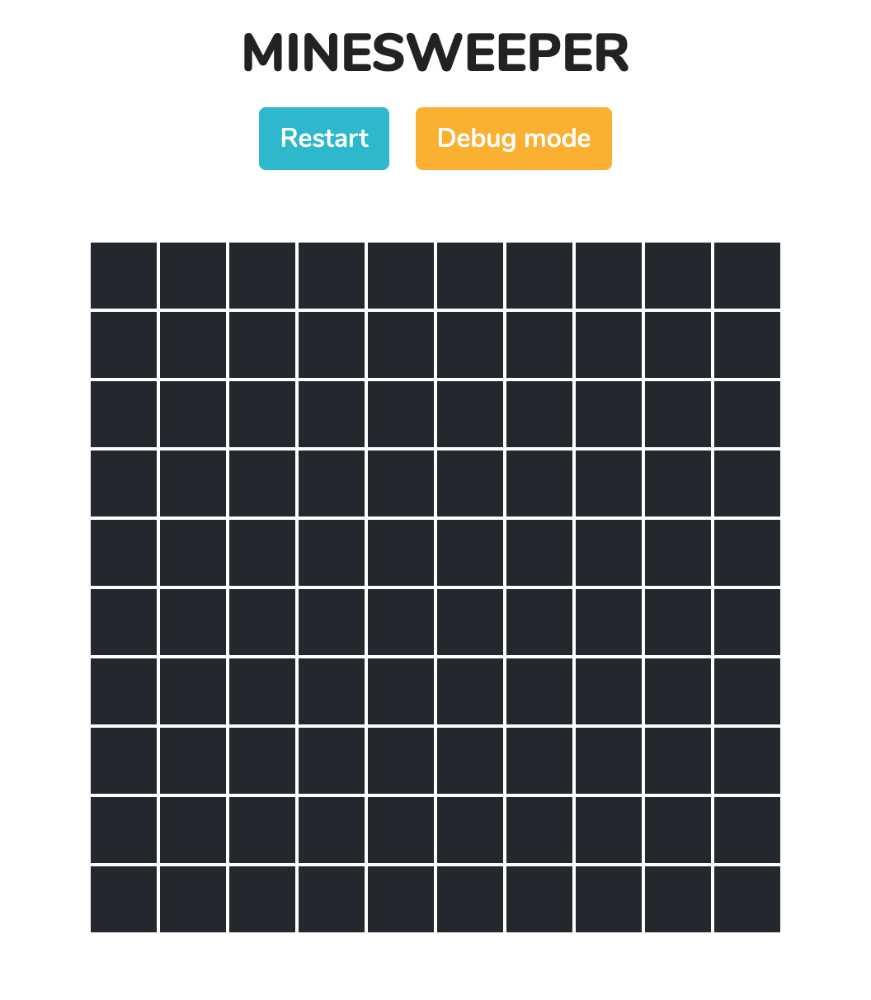

<!-- PROJECT SHIELDS -->
<!--
*** I'm using markdown "reference style" links for readability.
*** Reference links are enclosed in brackets [ ] instead of parentheses ( ).
*** See the bottom of this document for the declaration of the reference variables
*** for contributors-url, forks-url, etc. This is an optional, concise syntax you may use.
*** https://www.markdownguide.org/basic-syntax/#reference-style-links
-->

<!-- PROJECT LOGO -->
<br />
<p align="center">
  <a href="https://github.com/RoxBow/Minesweeper">
    
  </a>

  <h3 align="center">MINESWEEPER</h3>

  <p align="center">
    <a href="https://github.com/RoxBow/Minesweeper"><strong>Explore the docs »</strong></a>
    <br />
    <br />
    <a href="https://minesweeper-vince.netlify.com">View Demo</a>
  </p>
</p>

<!-- TABLE OF CONTENTS -->
## Table of Contents

* [About the Project](#about-the-project)
  * [Built With](#built-with)
* [Getting Started](#getting-started)
  * [Installation](#installation)

<!-- ABOUT THE PROJECT -->
## About The Project

<p align="center">

</p>

### Built With

* []() create-react-app
* []() typescript

<!-- GETTING STARTED -->
## Getting Started

To get a local copy up and running follow these simple steps.

### Installation
 
1. Clone the repo
```sh
git clone https://github.com/RoxBow/Minesweeper.git
```
2. Install NPM packages
```sh
npm install
``` 
or 
```sh
yarn
```

<!-- MARKDOWN LINKS & IMAGES -->
[minesweeper-screenshot]: ./src/assets/img/screen.png
[logo]: https://cdn.pixabay.com/photo/2017/01/31/16/59/bomb-2025548_960_720.png

<!-- PROJECT SHIELDS -->
<!--
*** I'm using markdown "reference style" links for readability.
*** Reference links are enclosed in brackets [ ] instead of parentheses ( ).
*** See the bottom of this document for the declaration of the reference variables
*** for contributors-url, forks-url, etc. This is an optional, concise syntax you may use.
*** https://www.markdownguide.org/basic-syntax/#reference-style-links
-->
